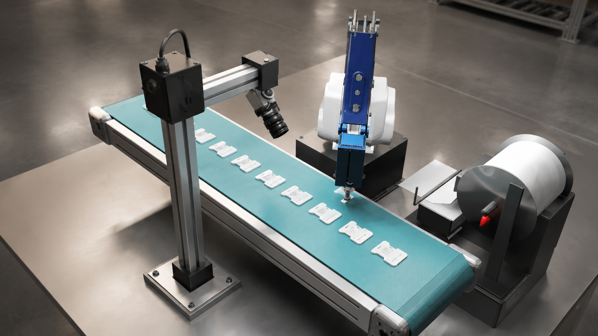
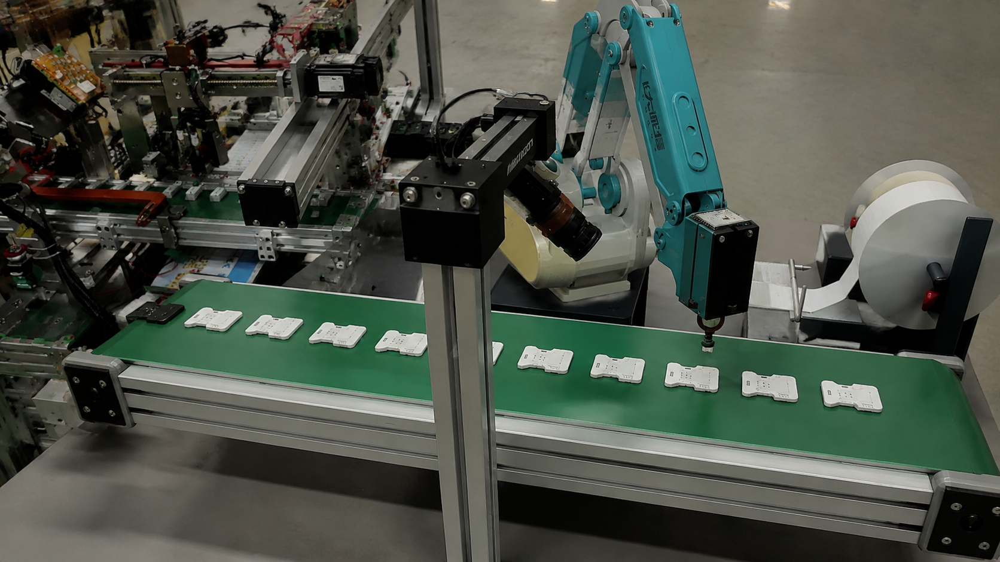
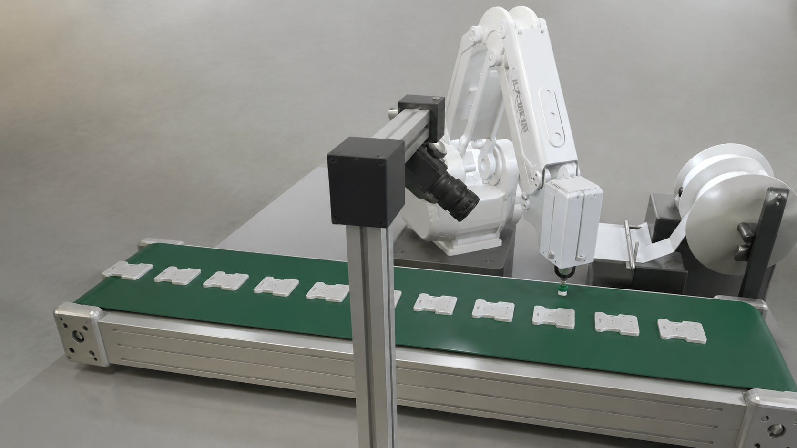
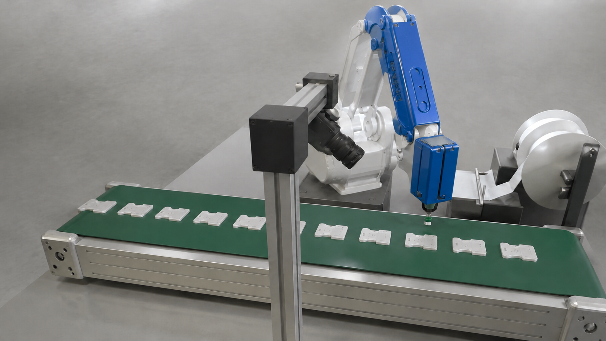

# MG400 Cartesian IK demo (Godot 4)

This Godot 4 project animates the separate MG400 URDF link meshes and drives
the tool centre point (TCP) from a Cartesian world-space target. It is the
first-stage robot sandbox for the later label-stripper/conveyor demonstration.

The scene also contains an 800 × 200 × 70 mm tabletop conveyor positioned
lengthwise beneath the MG400 work envelope. Its editable Blender source is
`source_assets/conveyor/conveyor.blend`; Godot loads the exported
`assets/conveyor/conveyor.glb`.

A thin molded product based on `material/1.jpg` through `material/5.jpg` starts
at the conveyor infeed and continuously travels to the outfeed. Its verified
imported dimensions are exactly 37.95 × 46.00 × 4.00 mm, and its bottom face
rests on the belt surface throughout the loop.

A dimensioned label stripper/emitter is anchored by its emitted-label center
at MG400 coordinates `X 53.0, Y 231.4, Z 150.4 mm`. In Godot Y-up world space
that is `(0.0530, 0.1504, -0.2314) m`. The model faces the emitted label toward
the robot, and its 70.4 mm pad reaches exactly to the floor.

The supplied `material/Logo_Alt_2@2x.png` is mounted along the narrow groove on
the long diagonal blue `link4_2` upper-arm member identified in
`material/logo_position.png`, so it follows that linkage during IK motion.

The MG400 TCP carries a compact SMT vacuum nozzle modeled from
`material/nozzle.jpg` and the generated CAD reference. Its practical
industry-style envelope is an 8 × 8 × 6 mm mounting block, 6 mm shank, 8 mm
barrel, 12 mm silicone cup, and 25.5 mm overall length. The Blender local
origin is the mounting interface. The Godot attachment corrects the
Blender/ROS frame conversion so the suction cup points down along world -Y
toward the conveyor, and the nozzle follows every IK pose automatically.

## Run

Open this directory in Godot 4 and run `main.tscn`, or use:

```sh
/Applications/Godot.app/Contents/MacOS/Godot --path .
```

The default mode follows a closed, lookahead-planned Cartesian waypoint loop.
Press Space for manual jog mode, then use the arrow keys for the floor plane,
R/F for height, and Q/E for tool yaw. Press `0` or Mac Delete to return the
target to a known reachable point.

### Camera controls

- Two-finger trackpad motion: orbit yaw and pitch
- Control + two-finger motion: change camera distance
- Shift + two-finger motion: pan horizontally and vertically
- `C`: reset the camera view
- `Show info` checkbox: show or hide the status and controls overlay
- `Show conveyor info` checkbox: show or hide the conveyor gap, speed, station,
  product-count, flow-state, and Q-pace panel independently
- `F9` or `Ctrl+R`: start/stop runtime MP4 recording
- Middle-mouse drag offers the same orbit behavior, with Control and Shift as
  zoom and pan modifiers. The mouse wheel also zooms.

The information overlay continuously displays the camera world position plus
its orbit yaw, pitch, distance, and focus point. These values completely
describe the current view and can be used to reproduce a placement screenshot.

### HeyRoute realistic perspective render

Using the viewport values from `截屏2026-08-31 15.12.07.png`—camera position
`(0.7513, 0.6970, -0.5712) m`, yaw `137.07°`, pitch `32.50°`, distance
`0.9250 m`, and focus `(0.220, 0.200, 0.000) m`—HeyRoute was used to create a
clean photorealistic production-cell render with the UI removed:



Source reference: `截屏2026-08-31 15.12.07.png`; generated image:
`material/generated/mg400_realistic_render.png`.

For the second perspective, `截屏2026-08-31 15.18.04.png` reports camera
position `(0.8697, 0.5039, -0.1589) m`, yaw `103.74°`, pitch `24.44°`,
distance `0.7346 m`, and focus `(0.220, 0.200, 0.000) m`. Using that viewport
as the composition reference and `mpv-shot0001.jpg` as the real production-line
style reference produced:



Generated image: `material/generated/mg400_production_line_render.png`.

A cleaned variant was generated from `截屏2026-08-31 15.18.04.png` with
`mpv-shot0001.jpg` used strictly as a style reference. Only the simulator’s
necessary components are preserved; equipment and geometry unique to the MPV
reference are intentionally excluded:



Generated image: `material/generated/mg400_production_line_clean_render.png`.

The clean production-line render was also color-corrected so the MG400 arm
link covers use the intended blue painted finish while retaining the white
body panels and all other scene components:



Generated image: `material/generated/mg400_production_line_blue_robot_render.png`.

### Runtime video recording

The project includes the runtime recorder adapted from the locomotion tutorial.
It is a global autoload, so it works in both `main.tscn` (MG400) and the
standalone `fairino3_demo.tscn` scene. Press `F9` (or `Ctrl+R`) while the game is running to toggle capture. Frames are
read back from the Godot viewport and streamed asynchronously to FFmpeg, so
encoding and file I/O do not block the simulation loop. The default output is a
1280 × 720 H.264 MP4 in the project’s `recordings/` directory. The in-game
recording indicator and a small status window show recording, finalization, and
saved/error states, including the generated filename. Change codec, encoder,
frame rate, dimensions, bitrate, output directory, or FFmpeg path in the
`[runtime_recorder]` section of `project.godot`. FFmpeg must be installed
separately (Homebrew: `brew install ffmpeg`). For packaged/read-only builds,
set `output_directory="user://recordings"` instead.

Verify the recorder autoload and local FFmpeg configuration with:

```sh
/Applications/Godot.app/Contents/MacOS/Godot \
  --headless --path . --script tests/test_runtime_recorder.gd
```

### Exporting a Windows 10 executable

The simulator does not need Godot installed on the Windows machine. Export it
from the Godot editor on macOS (or from a Windows development machine) using
the matching Godot 4.7.x export templates:

1. Install the **Windows Desktop** export template from **Editor > Manage
   Export Templates**.
2. Open **Project > Export**, click **Add… > Windows Desktop**, and set the
   architecture to **x86_64**. Set the output to
   `build/MG400_Cartesian_IK.exe` and enable **Embed PCK** if you want a single
   portable executable. Leaving it disabled creates a neighbouring
   `MG400_Cartesian_IK.pck`; distribute both files together.
3. Click **Export Project**. The scene, imported meshes, textures, and scripts
   referenced by `main.tscn` are collected automatically. The ROS checkout,
   Blender source files, tests, and editor-only material do not need to be
   copied to the Windows computer.

The repository includes this preset as `export_presets.cfg`, so the same
release build can also be made from a terminal:

```sh
/Applications/Godot.app/Contents/MacOS/Godot \
  --headless --path /Users/hotcat/zhouyu/MG400 \
  --export-release "Windows Desktop" \
  build/MG400_Cartesian_IK.exe
```

For video recording, either install FFmpeg and add it to the Windows `PATH`,
or copy `ffmpeg.exe` from a trusted FFmpeg Windows build into the same folder
as `MG400_Cartesian_IK.exe`. The recorder searches that folder automatically.
In an exported build recordings are written to Godot's writable user folder,
normally `%APPDATA%\\Godot\\app_userdata\\MG400 Cartesian IK Demo\\recordings\\`.
The first launch may be blocked by Windows SmartScreen; choose **More info >
Run anyway** only when the executable came from your trusted build source.

To deliver an installer rather than a portable folder, zip the EXE (and PCK if
not embedded) plus `ffmpeg.exe`, or wrap that folder with Inno Setup or NSIS.
An installer does not change the Godot runtime requirements; it simply places
the same files under `Program Files` and can create a desktop shortcut.

### Conveyor product motion

The production stream moves along the conveyor's transformed long axis and
wraps from the outfeed back to the infeed. `Product gap` is the exact clear
edge-to-edge interval in millimetres. The controller combines that gap with
the 46 mm product length, calculates how many products fit on the usable belt,
and rebuilds the product pool whenever the interval changes.

Use the always-visible `CONVEYOR FLOW` panel to adjust product gap and belt
speed while the simulation is running. The default 20 mm gap produces 11
products at 100 mm/s. The information overlay also shows gap, product count,
throughput per minute, and loop duration. When a trajectory contains
`trigger q`, the flow panel additionally reports the number of Q events, the
measured time between the latest two events, and the corresponding
event-based production pace in products per minute. This statistic is driven
by trajectory triggers rather than the belt-speed setting.

`Stop at MG400 Y` configures a production station in millimetres; its default
is `228.0 mm`. Because MG400 uses Z-up coordinates, Cartesian Y maps to negative
Godot world Z in this project. When any product reaches the station, the whole
conveyor clamps exactly at that coordinate. Press `Q` to resume; the following
product will stop at the same station. While stopped, `Q` is reserved for the
conveyor instead of manual tool yaw.

The reusable controller is `scripts/conveyor_product_motion.gd`. Its exported
`product_interval_mm`, `product_speed_mps`, `conveyor_length_m`, and product
dimensions can also be configured on the `ProductFlow` node in `main.tscn`.

## Cartesian API

The reusable robot component is `scripts/mg400_robot.gd` (`MG400Robot`). Its
main command accepts standard Godot world coordinates (Y-up):

```gdscript
var reachable := robot.set_tcp_target_world(
    Vector3(world_x, world_y, world_z),
    tool_yaw_radians
)
```

Use the optional third argument `true` to apply the pose immediately. The
normal path is smoothed at `joint_speed`. An unreachable target is projected
to the physical workspace and the method returns `false`.

`urdf_position_to_world(Vector3(x, y, z))` converts ROS/MG400 Z-up coordinates
to Godot world coordinates. All dimensions are metres.

## Fairino3 V6 six-axis scene

`fairino3_demo.tscn` is a separate scene for the FAIRINO Fairino3 V6 cobot.
It uses the official [frcobot_ros2 repository](https://github.com/FAIR-INNOVATION/frcobot_ros2)
and its [`fairino3_v6_moveit2_config`](https://github.com/FAIR-INNOVATION/frcobot_ros2/tree/main/fairino3_v6_moveit2_config)
URDF definition. The seven visual link STLs are kept under
`assets/fairino3_v6/`; converted OBJ render assets are under
`assets/fairino3_v6_obj/` so Godot can import them without a ROS installation.
The source URDF is saved as `assets/fairino3_v6/fairino3_v6.urdf`. If an STL
is replaced, regenerate the Godot meshes with:

```sh
python3 tools/convert_stl_to_obj.py \
  assets/fairino3_v6 assets/fairino3_v6_obj
```

Run it from the editor by opening `fairino3_demo.tscn`, or from the terminal:

```sh
/Applications/Godot.app/Contents/MacOS/Godot \
  --path /Users/hotcat/zhouyu/MG400 \
  --editor fairino3_demo.tscn
```

The Fairino3 controller in `scripts/fairino3_robot.gd` builds the URDF joint
frames (j1–j6), applies the published joint limits, and solves Cartesian TCP
position with a bounded numerical Jacobian-transpose IK loop. Its manual jog
controls intentionally match the MG400 scene: press `Space` to switch between
automatic trajectory mode and manual mode, use the arrow keys for X/Z, `R`/`F`
for height, and `Q`/`E` for TCP yaw rotation. `PageUp`/`PageDown` are aliases
for `R`/`F`; `0` or `Backspace` returns to the default reachable pose. `L`
toggles trajectory looping. It accepts the same
`.traj` files as the MG400 scene, including feed rate, acceleration, waypoint
delays, and `trigger` events:

The yellow-centered runtime TCP gizmo provides direct placement: drag the red
X, green Y, or blue Z handle to move the requested Cartesian coordinate. Each
drag pauses the trajectory, invokes the six-axis IK solver, and leaves the
gizmo attached to the actual TCP. The panel reports `IK REACHABLE` for a valid
target and `IK CLAMPED` when a drag exceeds the workspace.

The **TCP FLANGE OFFSET (MM)** panel defines the tool-center-point calibration
relative to the J6 flange. X/Y/Z use the flange axes (including flange Z), so
the offset rotates with the tool as the cobot moves. Entering an offset pauses
automatic playback and moves only the TCP marker/gizmo; the robot joints and
flange stay fixed, matching a cobot pendant TCP setup. The public
`Fairino3Robot.translate_tcp()` method remains available for scripted relative
Cartesian moves in metres and does command the IK solver.

Pose-entry focus is mouse-scoped: click a Roll/Pitch/Yaw or J1–J6 field to
edit it. As the pointer enters any UI panel, an edited field is automatically
defocused; clicking `Align Flange to Base`, `Capture Current`, or another
control therefore activates it on the first click. Click the 3D viewport to
return to TCP navigation. Arrow keys and `R`/`F` then jog the TCP instead of
changing the text field or moving the UI focus rectangle.

The **OVERLAYS** toolbar provides independent visibility switches for Status,
Joints, Pose, TCP offset, Pickup, and Recording. Hiding one overlay leaves the
others interactive and does not change simulation state.

### Do you need ROS 2 / MoveIt 2?

Not for this visual simulator. Godot has no built-in general-purpose solver
that automatically understands a ROS URDF, but this scene includes a bounded
numerical six-axis solver and the individual-joint controls/gizmo are useful
for interactive placement. It is appropriate for visual demonstration,
trajectory timing, and operator training.

MoveIt 2 becomes worthwhile when you need collision checking against the
conveyor or camera, self-collision avoidance, deterministic selection among
multiple IK branches, orientation constraints, obstacle-aware planning, or
joint velocity/acceleration limits matching the real controller. In that
architecture, run MoveIt as an offline or network planning service, send the
resulting joint trajectory to Godot, and keep Godot as the renderer. Embedding
a full ROS 2 + MoveIt stack into a Windows Godot EXE is usually unnecessary and
makes deployment much heavier.

The scene now offers two IK paths. Normal trajectories retain the fast
position-first solver. Enabling **Constrain world orientation** activates the
full pose solver for XYZ plus world roll/pitch/yaw. Enter R/P/Y explicitly,
use **Capture Current** to hold the present tool frame, or press **Align Flange
to Base** to make the flange surface parallel to the horizontal base plane
(its local +Z normal points down along Godot world −Y). This matches the
reference screenshot pose, where the flange/tool axis points down toward the
work surface. The dedicated pose indicator remains
green only when both position and orientation converge within tolerance. An
XYZ may be position-reachable but pose-unreachable because the requested wrist
orientation encounters a joint limit; move the TCP gizmo slightly and retry.
The Fairino pendant panel currently implements the manual's **Base** Cartesian
flange jog using RX/RY/RZ SpinBox controls styled like the orientation panel.
Changing RX, RY, or RZ applies an incremental rotation around the corresponding
robot-base axis while keeping TCP X/Y/Z latched. The SpinBox arrows support
press-and-hold adjustment. Tool and Wobj frames remain visibly reserved for a
later extension. Pendant rotation is disabled while the deterministic pickup
sequence owns the Cartesian target, so product attachment is unaffected.

For production-grade collision-aware planning, use MoveIt to generate the
joint path and replay it in this scene.

The Cartesian endpoint is the official J6 flange center, not the J6 joint
origin. In the supplied wrist3 STL the mounting face is 100 mm along local +Z
from the J6 rotation center, so `Fairino3Robot/TCP` is parented under `j6` with
the URDF-local offset `(0, 0, 0.100 m)`. The TCP gizmo and both IK solvers use
this flange point.

### H89 product and side-wall gripper

The Fairino3 scene includes an upright H89 calibration product based on
`cads/H89-converted.dxf`, represented by the requested 37.95 × 46.00 × 4.00 mm
envelope. Its 46 mm side is vertical and its 4 mm thickness is along local Z.
`Fairino3Robot/TCP/ParallelJawGripper` is a visual parallel-jaw tool: the jaws
close across the thin side wall and extend along the TCP/flange +Z direction.
The product carries two simple fiducial bars and the gripper exposes matching
reference geometry to make hand-eye and camera-parameter setup repeatable.

The **GRIPPER PICKUP SIMULATION** panel provides two repeatable approaches:
**Thin side** (the product-width closing setup) and **Long side** (90-degree
jaw rotation). Each sequence approaches the upright product, closes the jaws,
attaches the product to the TCP, lifts it, and moves it to a fixed placement
pose. Press **Reset pickup** after each run to return the product and jaws to
their initial state and try another method. Pickup motion uses the same
LinuxCNC-style Cartesian planner as trajectory files, including acceleration
limits and a `grip_close` waypoint trigger; it is not a timer-based teleport.
At the grasp trigger the planner pauses while the robot physically settles at
the computed jaw/product overlap pose. The jaws then close for a short visible
close cycle, and only after that cycle does the product reparent to the gripper;
this keeps the product stationary during approach and prevents a teleport into
the final carry pose.
The approach state opens the jaws to a 50 mm inner gap (wide enough to clear
the complete 37.95 mm product width), while the thin-side grip closes to the
37.95 mm product width. The rotated long-side grip closes across the 4 mm
product thickness, with enough travel to reach the opposing front/back faces.
The product keeps its original upright orientation throughout pickup, and no
cyan center reference object is added to the gripper. The full-length jaws are
retained, but the pickup pose seats the product at the jaw end so only its
upper/end quarter is held while the rest hangs clear for placement.

```sh
/Applications/Godot.app/Contents/MacOS/Godot \
  --path /Users/hotcat/zhouyu/MG400 \
  --scene fairino3_demo.tscn \
  -- --trajectory=/absolute/path/to/fairino3_pick.traj
```

The verification script exercises three reachable Cartesian targets and checks
the TCP error against the requested pose:

```sh
/Applications/Godot.app/Contents/MacOS/Godot \
  --headless --path . --script tests/test_fairino3.gd
```

## LinuxCNC-style Cartesian trajectory planner

`scripts/cartesian_trajectory_planner.gd` accepts a list of Cartesian waypoints
and generates linear segments with a commanded feed rate, acceleration-limited
trapezoidal/triangular profiles, and junction-deviation lookahead. Forward and
backward passes limit each corner so the tool blends through reachable junctions
instead of stopping at every coordinate, while the first and last waypoints
remain exact stops.

`Main` exposes `set_cartesian_trajectory_world()` for Godot metres and
`set_cartesian_trajectory_urdf()` for MG400/ROS millimetres. The default scene
uses a closed five-point loop at 120 mm/s with 500 mm/s² acceleration. Press
Space to pause/resume the planned path alongside the existing manual mode.

The planner reports sampled position, yaw, feed speed, elapsed/total time,
segment count, and completion state. Replace the default list with your own
coordinates from another script, for example:

```gdscript
var points := [
    Vector3(240.0, 0.0, 245.0),
    Vector3(335.0, 0.0, 245.0),
    Vector3(335.0, 80.0, 245.0),
]
$Main.set_cartesian_trajectory_urdf(points, 150.0, 600.0, 1.0)
```

### Editing trajectories in Emacs

`tools/emacs/mg400-traj-mode.el` provides a major mode for the dedicated
`.traj` files. It follows the conventions of the supplied `godot-pose-mode`:
the document stays plain text and Git-friendly, while validation and preview
are available as buffer commands. Add the mode to your Emacs load path:

```elisp
(add-to-list 'load-path "/Users/hotcat/zhouyu/MG400/tools/emacs")
(require 'mg400-traj-mode)
```

Opening `trajectories/label_application.traj` automatically selects
`mg400-traj-mode`. The file has two sections: `[trajectory]` contains
`feed_mm_s`, `acceleration_mm_s2`, `junction_deviation_mm`, and `loop`; each
row in `[waypoints]` is `X_mm Y_mm Z_mm yaw_deg` (yaw is optional). Values use
MG400/ROS millimetres and degrees, matching `set_cartesian_trajectory_urdf()`.
After a waypoint, add `delay seconds` to hold the TCP at that point, or
`trigger key` to emit a named runtime trigger. `trigger q` resumes the conveyor
when it is stopped at the configured station; `trigger w` shows the label held
by the nozzle and `trigger e` hides it. Multiple event rows may follow the same
waypoint.

```text
[waypoints]
80.6 221.0 174.0 0.0
80.6 221.0 211.0 0.0
271.6 162.0 197.0 0.0
delay 1.5
271.6 162.0 166.0 0.0
trigger q
271.6 162.0 225.0 0.0
```

The mode's commands are:

- `C-c C-v` (`mg400-traj-validate`) checks the document and reports its motion
  parameters.
- `C-c C-i` (`mg400-traj-insert-waypoint`) prompts for X/Y/Z/yaw and appends a
  waypoint to the section.
- `C-c C-r` (`mg400-traj-run`) saves, validates, and launches Godot with the
  current file: `-- --trajectory=/absolute/path/file.traj`.
- `C-c C-s` saves the buffer.

Customize `mg400-traj-godot-executable` when Godot is not on its default path,
or set `mg400-traj-default-project-root` when the trajectory file lives
outside this project. `#` starts a comment, and aliases such as
`velocity_mm_s` and `accel_mm_s2` are accepted for convenient editing.

## Model and IK notes

- The animated model uses the nine separate meshes in
  `MG400_ROS/mg400_description/meshes`. The single root-level SolidWorks STL is
  a fused assembly and cannot articulate.
- `tools/convert_stl_to_obj.py` is a dependency-free converter used because
  Godot does not import binary STL as a runtime mesh. Rebuild assets with:

  ```sh
  python3 tools/convert_stl_to_obj.py \
    MG400_ROS/mg400_description/meshes assets/mg400
  ```

- The solver is closed-form for the MG400 parallelogram. It uses the URDF joint
  origins and limits, resolves both elbow branches, chooses a legal continuous
  branch, and applies the URDF mimic joints to both sides of the mechanism.
- Verify the solver headlessly with:

  ```sh
  /Applications/Godot.app/Contents/MacOS/Godot \
    --headless --path . --script tests/test_ik.gd
  ```

## Rebuild the conveyor

The conveyor is generated as real Blender geometry at metre scale. Rebuild the
`.blend`, `.glb`, and Blender preview with:

```sh
/Applications/Blender\ 4.5.app/Contents/MacOS/Blender \
  --background --python tools/build_conveyor.py
```

The original photo, the HeyRoute-generated modeling reference, and the Blender
preview are stored under `material/`.

## Rebuild the label stripper

The emitted-label center is Blender local origin `(0,0,0)`. Rebuild its Blender
source, GLB, and preview with:

```sh
/Applications/Blender\ 4.5.app/Contents/MacOS/Blender \
  --background --python tools/build_label_stripper.py
```

Files:

- Editable source: `source_assets/label_stripper/label_stripper.blend`
- Godot model: `assets/label_stripper/label_stripper.glb`
- Generated modeling reference: `material/generated/label_stripper_reference.png`
- Blender preview: `material/generated/label_stripper_blender_render.png`

Verify its origin and floor contact with:

```sh
/Applications/Godot.app/Contents/MacOS/Godot \
  --headless --path . --script tests/test_label_stripper.gd
```

## Rebuild the SMT nozzle

Rebuild the editable Blender source, GLB, and preview render with:

```sh
/Applications/Blender\ 4.5.app/Contents/MacOS/Blender \
  --background --python tools/build_smt_nozzle.py
```

Files:

- Editable source: `source_assets/smt_nozzle/smt_nozzle.blend`
- Godot model: `assets/smt_nozzle/smt_nozzle.glb`
- HeyRoute modeling reference: `material/generated/smt_nozzle_reference.png`
- Blender preview: `material/generated/smt_nozzle_blender_render.png`

Verify the TCP attachment and envelope with:

```sh
/Applications/Godot.app/Contents/MacOS/Godot \
  --headless --path . --script tests/test_smt_nozzle.gd
```

## Rebuild the product label

The nozzle carries a thin, clipped-corner label sized to the product's
recessed panel. The panel in the product model is 27.8 × 10.2 mm; the label
backing is 27.0 × 9.4 mm and the paper face is 26.8 × 9.2 mm with a 0.16 mm
thickness. Its Blender source origin is the nozzle-facing surface. Rebuild the
source, GLB, and preview with:

```sh
/Applications/Blender\ 4.5.app/Contents/MacOS/Blender \
  --background --python tools/build_product_label.py
```

Files:

- Editable source: `source_assets/product_label/product_label.blend`
- Godot model: `assets/product_label/product_label.glb`
- Blender preview: `material/generated/product_label_blender_render.png`

The label is parented under `MG400Robot/TCP/SMTNozzle/ProductLabel`, offset to
the nozzle tip, and follows every IK pose and tool-yaw rotation.

## Rebuild the product

The product uses its geometric center as the Blender/Godot origin. Rebuild its
editable Blender source, GLB, and preview with:

```sh
/Applications/Blender\ 4.5.app/Contents/MacOS/Blender \
  --background --python tools/build_product.py
```

Files:

- Editable source: `source_assets/product/product.blend`
- Godot model: `assets/product/product.glb`
- Generated modeling sheet: `material/generated/product_reference.png`
- Blender preview: `material/generated/product_blender_render.png`

Verify its exact size, belt contact, and centered placement with:

```sh
/Applications/Godot.app/Contents/MacOS/Godot \
  --headless --path . --script tests/test_product.gd
```

## HIKROBOT MV-CS200-10GC industrial camera

The reusable camera asset models the official second-generation HIKROBOT CS
housing with a compact 20 MP 1-inch C/CS-mount lens. The requested “GS200” is
the `MV-CS200-10GC`: Sony IMX183, 5472 × 3648, 5.9 fps, GigE. Its verified body
dimensions are 29 × 29 × 42 mm; the attached lens has a 33 mm maximum diameter
and 42 mm optical length.

The nominal installation reference is the requested MG400 coordinate
`X 262.9, Y 117.0, Z 291.3 mm`. The camera model in `main.tscn` uses the later
visually adjusted installation pose at Godot position
`(0.2629, 0.302346, -0.009776) m`, angled toward the conveyor work area. The
placement regression test records the complete basis so accidental scene
transform changes are detected.

Official source: [HIKROBOT CS Series Area Scan Camera](https://www.hikrobotics.com/en/machinevision/visionproduct?typeId=78&id=134)

Files:

- Godot model: `assets/hikrobot_gs200/hikrobot_gs200.glb`
- Editable source: `source_assets/hikrobot_gs200/hikrobot_gs200.blend`
- Godot preview scene: `scenes/hikrobot_gs200_preview.tscn`
- Official image: `material/generated/hikrobot_gs200_official.png`
- Generated modeling sheet: `material/generated/hikrobot_gs200_reference.png`
- Blender preview: `material/generated/hikrobot_gs200_blender_render.png`

Rebuild and verify:

```sh
/Applications/Blender\ 4.5.app/Contents/MacOS/Blender \
  --background --python tools/build_hikrobot_gs200.py

/Applications/Godot.app/Contents/MacOS/Godot \
  --headless --path . --script tests/test_hikrobot_gs200.gd
```

Run the standalone interactive camera preview:

```sh
/Applications/Godot.app/Contents/MacOS/Godot \
  --path . scenes/hikrobot_gs200_preview.tscn
```

## GS200 adjustable camera bracket

The camera is supported by a floor-mounted aluminum-extrusion stand designed
around its restored scene pose. A 100 × 120 × 12 mm base is centered at Godot
world position `(0.4400, 0, -0.009776) m`, immediately outside the conveyor.
Its nearest edge retains 18.37 mm of clearance from the conveyor frame.

The stand uses a 30 × 30 mm vertical post, 25 × 25 mm horizontal boom, sliding
carriage, lock knob, articulated drop link, and ball joint. The final
28 × 32 × 4 mm plate follows the camera's tilted basis and meets its top-face
M3 mounting pattern without changing the camera position or orientation.

Files:

- Godot model: `assets/hikrobot_gs200_bracket/hikrobot_gs200_bracket.glb`
- Editable source: `source_assets/hikrobot_gs200_bracket/hikrobot_gs200_bracket.blend`
- Blender preview: `material/generated/hikrobot_gs200_bracket_blender_render.png`

Rebuild and verify:

```sh
/Applications/Blender\ 4.5.app/Contents/MacOS/Blender \
  --background --python tools/build_hikrobot_gs200_bracket.py

/Applications/Godot.app/Contents/MacOS/Godot \
  --headless --path . --script tests/test_hikrobot_gs200_bracket.gd
```

## Fairino3 `.traj2` programs and Emacs control

`tools/emacs/mg400-traj2-mode.el` provides a major mode for six-axis FR3
Cartesian programs. It is loaded automatically for files ending in `.traj2`
and follows the requested format: positions are ROS/FR3 X Y Z in millimetres,
followed by Pitch, Roll, Yaw and explicit J1-J6 joint angles in degrees. The
planner interpolates both channels on the same time profile, and execution
uses the supplied joints to preserve the requested IK branch. The optional
`[overlays]` section
controls each Fairino3 screen panel (`status`, `joints`, `orientation` or
`pose`, `translation` or `tcp_offset`, `pickup`, `recording`, and `pendant`).

Useful bindings:

- `C-c C-v` validates the document and requires exactly twelve waypoint numbers
  (`X Y Z Pitch Roll Yaw J1 J2 J3 J4 J5 J6`).
- `C-c C-r` launches Godot with the file using `--trajectory2=...`.
- `C-c C-u` saves and uploads it to a running Fairino3 scene.
- `C-c C-p` captures the current live FR3 pose (XYZ/Pitch/Roll/Yaw + J1–J6)
  and appends it to `[waypoints]`.
- `C-c C-i` inserts a complete 12-field waypoint; `C-c C-s` saves.

Load the mode from Emacs with `(load "/Users/hotcat/zhouyu/MG400/tools/emacs/mg400-traj2-mode.el")`,
or add `tools/emacs` to your `load-path` in your init file.

Runtime upload writes the absolute path to the ignored `.runtime/trajectory2.command`
handoff file. Fairino3 polls that file every 250 ms, reparses the program,
applies its overlay settings, and starts the new full-pose LinuxCNC-style
trajectory. Uploads received during the protected pickup sequence are deferred
until the pickup completes. Waypoint `delay <seconds>` and `trigger <key>`
commands remain available and are emitted at the corresponding waypoint.

Example launch:

```sh
/Applications/Godot.app/Contents/MacOS/Godot \
  --path . -- --trajectory2=/absolute/path/program.traj2
```
